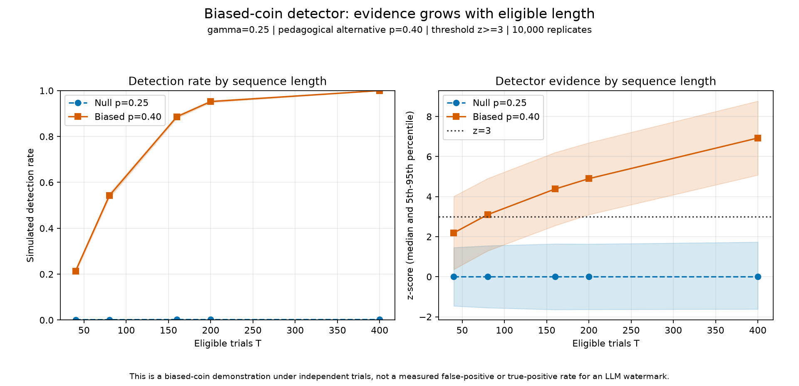

# Biased-coin detector

## Question

Why does a small statistical bias become easier to detect as the number of eligible trials
increases?

## Intuition before code

Under an independent null, random variation grows with the square root of the number of trials,
while a persistent excess grows in direct proportion to the number of trials.

## Derivation

For `T` independent trials with null hit probability `gamma`, the expected hit count is
`T * gamma` and its variance is `T * gamma * (1 - gamma)`. The lab standardizes observed hits
with `z = (G - T * gamma) / sqrt(T * gamma * (1 - gamma))` and also calculates an exact
binomial upper tail for fixed tests.

## The smallest implementation

`src/watermark_lab/stats.py` contains the formulas. `labs/01_biased_coin.py` keeps configuration,
simulation, scoring, aggregation, artifact writing, and plotting visible in execution order.

## Expected result before running

The null condition should stay centered near zero. The illustrative `p=0.40` condition should
move farther above the `z=3` threshold as sequence length grows.

## Observed result

With 10,000 replicates per condition and length, simulated biased detection rose from 21.33% at
`T=40` to 54.20% at `T=80`, 88.62% at `T=160`, 95.23% at `T=200`, and 100% at `T=400`.
The simulated null detection rate stayed between 0.13% and 0.21%. These are results for the
locked independent-coin configuration and `z>=3`, not calibrated LLM error rates.

## Figure

The selected values and complete provenance are in
[`artifacts/lab-01/summary.json`](../../artifacts/lab-01/summary.json). The artifact records source
commit `e99e9e5f9b8bc426d1cc4e13f874854f8c303475` and configuration SHA-256
`bb514264d259086929ef86d15e81fb2f44dfa6d5d1fa0f2b1d65586090ff6df9`.

## What surprised us

The short `T=40` biased group already produced detectable sequences, but most remained below the
threshold. By `T=80`, the same probability gap crossed 50% detection. The small simulated null
rates fluctuated rather than decreasing monotonically, which is a useful reminder that each point
is a finite Monte Carlo estimate.

## What this establishes

For this deliberately biased independent coin, a fixed probability gap accumulates standardized
evidence as eligible length grows. A reader can reproduce the curve with `just lab-01` and verify
every selected summary value from the ignored raw rows with `just verify-lab-01`.

## What this does not establish

The biased condition is not an LLM measurement, and the ideal binomial null is not an empirical
false-positive calibration for real token histories. This lab does not detect arbitrary AI text
or reproduce Claude's private detector.

## Next Lego block

After separate approval, Stage 2 can make the bias deliberate by coloring a tiny toy vocabulary.
